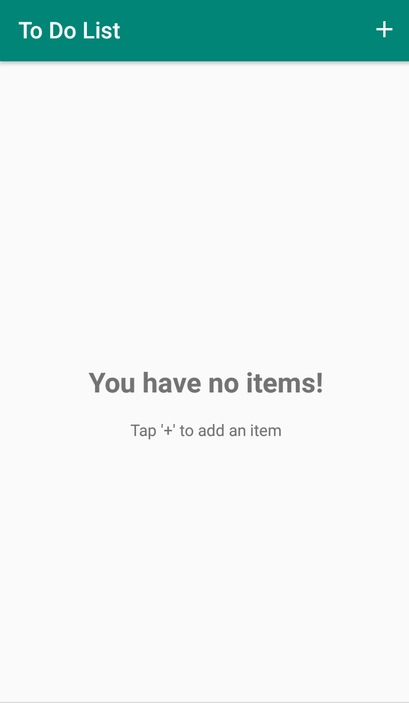
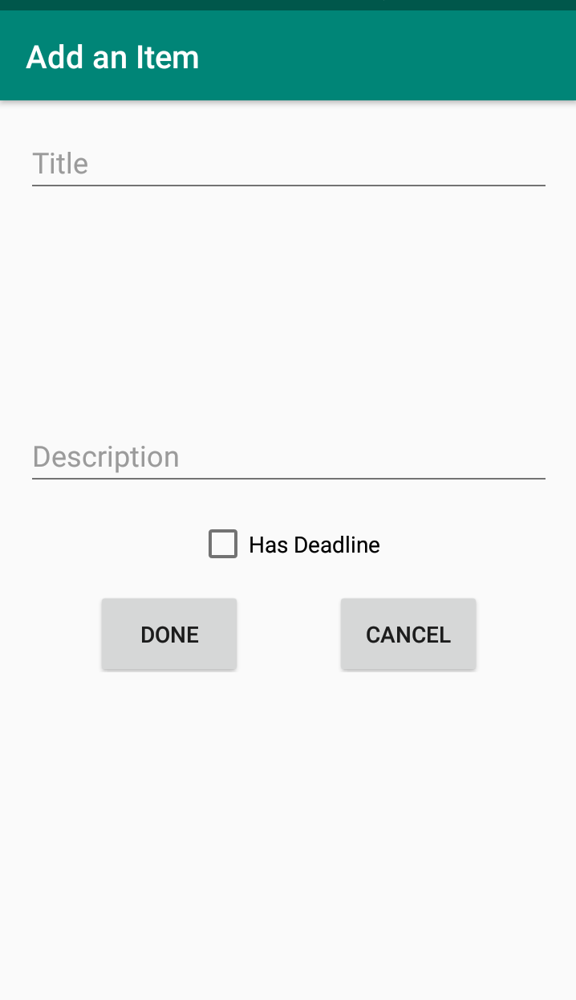
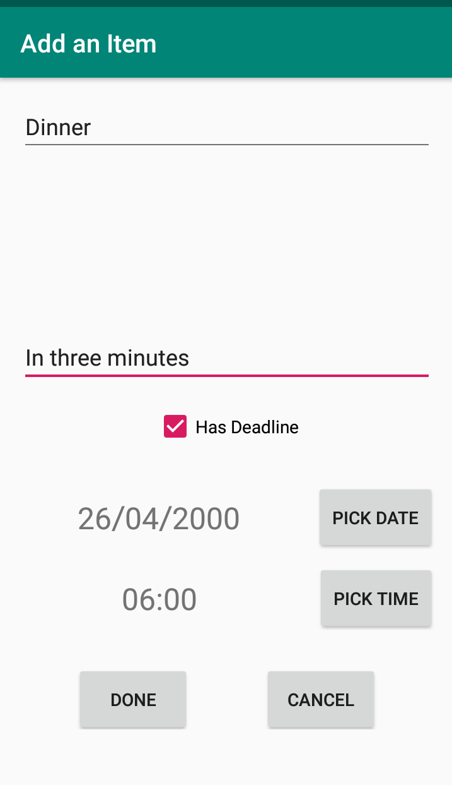
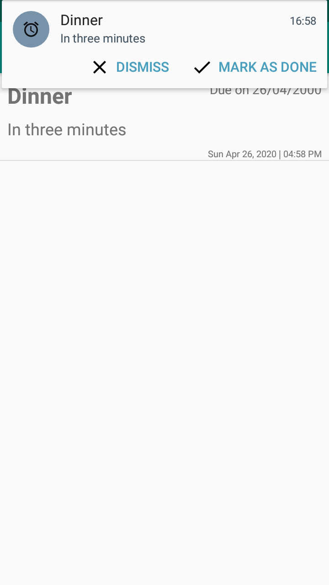
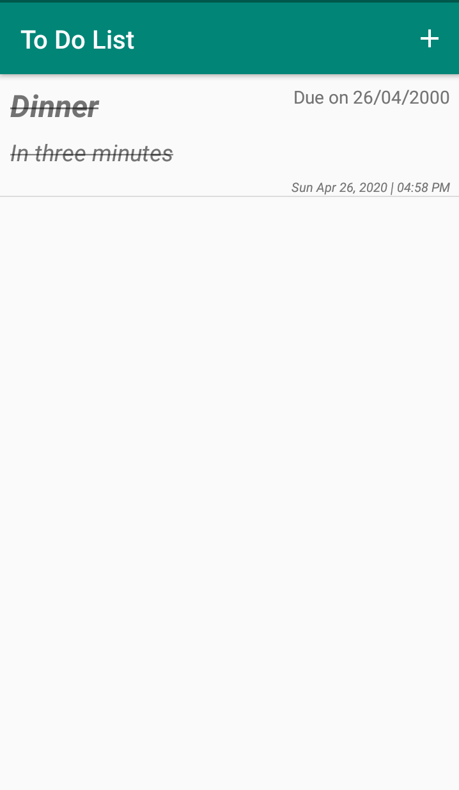
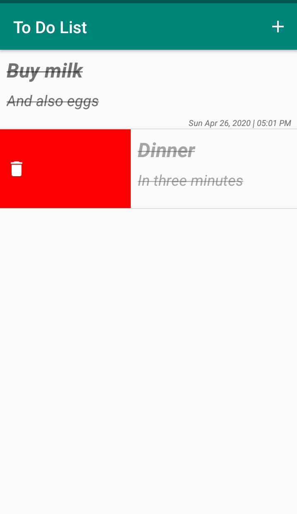
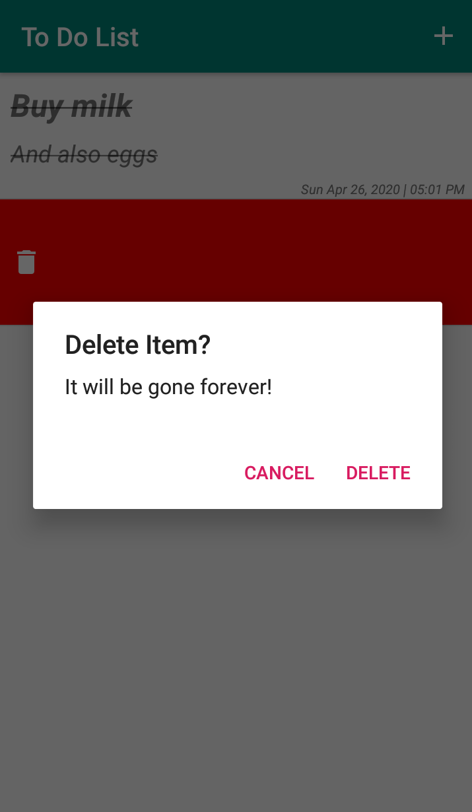

# To Do List
A simple app that uses a database to store a list of tasks to be done. It also makes alarms

## Technologies Used
 - Room
 - Jetpack MVVM
 - Jetpack LiveData
 - AlarmManager and NotificationManager
 - I think RecyclerView swipe is also a worthy mention

## Screenshots
### Home No Items

### Add an Item

### Add an item screen filled

### Task Alarm Activated

### Item Marked Done

### Delete Finished Task

### Confirm Delete
